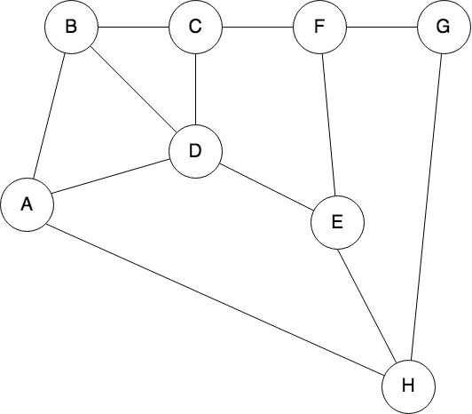

# moovup_test

Moovup Test

## Question 1

Use the following undirected graph ­- nodes can be visited only once:




- a. Write a function that returns all the possible paths between A­-H.

```
//define graph nodes
Map<String, List<String>> graph = {
    'A': ['B', 'D'],
    'B': ['A', 'C', 'D', 'E'],
    'C': ['B', 'F', 'G'],
    'D': ['A', 'B', 'E'],
    'E': ['B', 'D', 'H'],
    'F': ['C', 'G'],
    'G': ['C', 'F', 'H'],
    'H': ['E', 'G'],
  };

```
- b. Write a function that returns the least number of hops (shortest path) between A­-H.